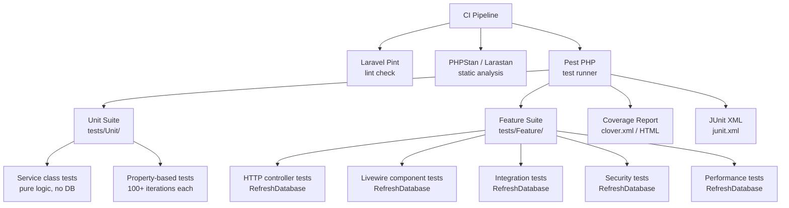
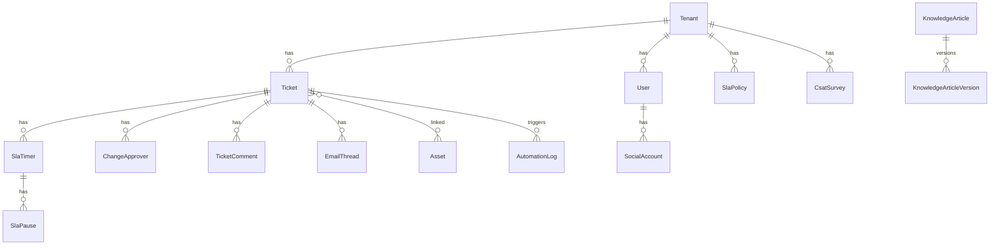

# Design Document: QA Comprehensive Audit — ServiceFlow

## Overview

This document describes the technical design for the ServiceFlow QA audit test suite. The suite is built on **Pest PHP v3** (which wraps PHPUnit 11) and covers every application layer: HTTP controllers, Livewire components, service classes, Eloquent models, policies, events, listeners, console commands, and CI tooling.

The design follows a **dual-testing philosophy**: example-based tests verify specific scenarios and integration points; property-based tests verify universal invariants across all valid inputs. Together they give the engineering team high confidence in correctness, security, and reliability for every release.

### Key Design Decisions

- **Pest PHP** is the primary test runner (already in `composer.json`). Its expressive syntax, `->repeat()` helper, and `arch()` plugin make it the natural choice for both example and property tests.
- **SQLite in-memory** is the default test database (already configured in `phpunit.xml`). It is fast, requires no external service, and is sufficient for all unit and feature tests.
- **No external PBT library is added.** PHP 8.2's `random_int` / `random_bytes` combined with Pest's `->repeat(N)` provides adequate generative testing without the overhead of a full PBT framework like `eris/eris`. Each property test runs a minimum of **100 iterations**.
- **Laravel fakes** (`Mail::fake`, `Event::fake`, `Http::fake`, `Storage::fake`) are used universally to isolate side effects.
- **Tenant isolation** is enforced in tests by binding a `TenantResolver` instance with a known tenant into the service container before each test that exercises tenant-scoped models.
- **Pest `arch()` plugin** is used for structural/coding-standards assertions (Requirement 22) without needing PHPStan at runtime.
- **MySQL-specific tests** are tagged `@group mysql` and run in a separate CI job; all other tests use SQLite in-memory.

---

## Architecture

### Test Execution Flow



### Layer-to-Test Mapping

| Application Layer | Test Category | Suite | DB Required |
|---|---|---|---|
| Service classes (pure logic) | Unit | `tests/Unit/` | No |
| Property-based correctness | Unit (PBT) | `tests/Unit/` | Conditional |
| HTTP Controllers | Feature | `tests/Feature/Http/` | Yes |
| Livewire Components | Feature | `tests/Feature/Livewire/` | Yes |
| Policies | Unit | `tests/Unit/Policies/` | No |
| Events & Listeners | Feature | `tests/Feature/Events/` | Yes |
| Multi-tenancy isolation | Feature | `tests/Feature/Tenancy/` | Yes |
| Security (CSRF, IDOR, XSS, injection) | Feature | `tests/Feature/Security/` | Yes |
| Performance (N+1, timing) | Feature | `tests/Feature/Performance/` | Yes |
| Asset management | Feature | `tests/Feature/Assets/` | Yes |
| Reports | Feature | `tests/Feature/Reports/` | Yes |
| Portal & CSAT | Feature | `tests/Feature/Portal/` | Yes |
| Installer | Feature | `tests/Feature/Installer/` | Yes |
| AI Assist | Feature | `tests/Feature/Ai/` | No |
| Cross-cutting invariants | Unit (PBT) | `tests/Unit/Invariants/` | Yes |
| Static analysis / linting | CI tooling | N/A | No |
| Coding standards (arch) | Unit | `tests/Unit/Arch/` | No |

---

## Components and Interfaces

### Base Test Case

`tests/TestCase.php` is extended by all test classes. It provides:

- `actingAsRole(string $role, ?Tenant $tenant = null): static` — creates a user with the given role, sets the tenant context, and calls `actingAs()`.
- `setTenant(Tenant $tenant): static` — binds the tenant into `TenantResolver` and sets `config('tenant.id')`.
- `withoutTenantScope(): static` — temporarily removes the global `TenantScope` for setup queries.

```php
// tests/TestCase.php (extended)
abstract class TestCase extends BaseTestCase
{
    protected function actingAsRole(string $role, ?Tenant $tenant = null): static
    {
        $tenant ??= Tenant::factory()->create();
        $user = User::factory()->for($tenant)->create(['role' => $role]);
        $this->setTenant($tenant);
        return $this->actingAs($user);
    }

    protected function setTenant(Tenant $tenant): static
    {
        app(TenantResolver::class)->setCurrent($tenant);
        config(['tenant.id' => $tenant->id]);
        return $this;
    }
}
```

### Pest Configuration

`tests/Pest.php` registers global `uses()` declarations:

```php
// tests/Pest.php
uses(Tests\TestCase::class)->in('Feature');
uses(Tests\TestCase::class, RefreshDatabase::class)->in('Feature');
uses(Tests\TestCase::class)->in('Unit/Policies');
uses(Tests\TestCase::class)->in('Unit/Invariants');
```

Unit tests that require the database (e.g., cross-cutting invariant tests) declare `uses(RefreshDatabase::class)` individually.

### Factory Strategy

New factories are created for every model that appears in tests:

| Factory | Model | Key states |
|---|---|---|
| `UserFactory` | `User` | `admin`, `agent`, `manager`, `team_lead`, `end_user` |
| `TenantFactory` | `Tenant` | `active`, `suspended` |
| `TicketFactory` | `Ticket` | `open`, `closed`, `withSlaTimers`, `withAttachments`, `change`, `problem` |
| `SlaPolicyFactory` | `SlaPolicy` | `default`, `forPriority(string)` |
| `SlaTimerFactory` | `SlaTimer` | `active`, `breached`, `stopped` |
| `SlaPauseFactory` | `SlaPause` | `active`, `resumed` |
| `TeamFactory` | `Team` | `withInboundEmail` |
| `AutomationFactory` | `Automation` | `active`, `inactive` |
| `AutomationLogFactory` | `AutomationLog` | `success`, `error` |
| `KnowledgeArticleFactory` | `KnowledgeArticle` | `draft`, `published`, `archived` |
| `EmailThreadFactory` | `EmailThread` | — |
| `ChangeApproverFactory` | `ChangeApprover` | `approved`, `rejected`, `pending` |
| `AssetFactory` | `Asset` | `active`, `retired`, `withTicket` |
| `CsatSurveyFactory` | `CsatSurvey` | `pending`, `responded` |
| `ServiceCatalogueItemFactory` | `ServiceCatalogueItem` | `active`, `inactive` |

All factories accept a `tenant_id` state so tenant-scoped records can be created cleanly:

```php
Ticket::factory()->for($tenant)->create();
```

---

## Data Models

### Test Database Strategy

**Primary database:** SQLite `:memory:` (configured in `phpunit.xml`). This works for all tests except those that require MySQL-specific features (e.g., `TIMESTAMPDIFF` in `ReportBuilder::agentPerformance`).

**MySQL-specific tests:** Tests that exercise raw SQL with MySQL functions are tagged `@group mysql` and skipped in the default SQLite run. They run in a separate CI job against a MySQL 8 container.

**Migrations:** `RefreshDatabase` runs all migrations before each test class. The `--seed` flag is not used by default; factories provide all test data.

**Transactions:** `RefreshDatabase` wraps each test in a transaction and rolls back after, keeping tests isolated and fast.

### Tenant Context in Tests

The `TenantScope` global scope reads from `app(TenantResolver::class)->currentId()`. Tests that exercise tenant-scoped models must call `setTenant()` before creating or querying records:

```php
beforeEach(function () {
    $this->tenant = Tenant::factory()->create();
    $this->setTenant($this->tenant);
});
```

For cross-tenant isolation tests, two tenants are created and the context is switched between them.

### Key Model Relationships Under Test



---

## Correctness Properties

*A property is a characteristic or behavior that should hold true across all valid executions of a system — essentially, a formal statement about what the system should do. Properties serve as the bridge between human-readable specifications and machine-verifiable correctness guarantees.*

### Property 1: Status Transition Graph Completeness

*For any* pair of status strings drawn from the full vocabulary (valid statuses plus arbitrary strings), `TicketStatusMachine::canTransition(from, to)` SHALL return `true` if and only if `to` appears in `TRANSITIONS[from]`, and `false` for every other pair.

**Validates: Requirements 2.1, 2.2**

### Property 2: Status Transition Path Correctness

*For any* valid path through the transition graph starting from `open`, applying `TicketStatusMachine::transition` step-by-step SHALL produce the expected final status at each step, and no intermediate step SHALL throw an exception.

**Validates: Requirements 2.6**

### Property 3: Business Hours Monotonicity

*For any* valid schedule configuration and any positive integer `N`, `BusinessHoursCalculator::addBusinessMinutes(start, N, schedule)` SHALL return a timestamp strictly greater than `start`.

**Validates: Requirements 5.1**

### Property 4: Business Hours Output Validity

*For any* valid schedule configuration and any positive integer `N`, the result of `addBusinessMinutes(start, N, schedule)` SHALL satisfy `isBusinessTime(result, schedule) == true`.

**Validates: Requirements 5.2**

### Property 5: Business Hours Round-Trip

*For any* valid schedule configuration and any positive integer `N`, `elapsedBusinessMinutes(start, addBusinessMinutes(start, N, schedule), schedule)` SHALL equal `N`.

**Validates: Requirements 5.4**

### Property 6: Business Minutes Non-Negativity

*For any* valid schedule configuration and any two timestamps `start` and `end`, `elapsedBusinessMinutes(start, end, schedule)` SHALL return a value greater than or equal to zero.

**Validates: Requirements 5.3**

### Property 7: Automation AND Metamorphic Negation

*For any* AND condition tree that evaluates to `true` against a given ticket, negating any single condition in the tree (replacing its `op` with its logical inverse) SHALL cause the overall evaluation to return `false`.

**Validates: Requirements 6.14**

### Property 8: Email Parser Robustness

*For any* input string (including empty strings, strings with no headers, and strings with malformed RFC 2822 structure), `EmailParser::parse` SHALL complete without throwing an exception.

**Validates: Requirements 7.9**

### Property 9: Email Parser fromAddress Invariant

*For any* well-formed email string containing a valid `From:` header with a syntactically correct email address, `EmailParser::parse` SHALL return a `ParsedEmail` whose `fromAddress` matches the RFC 5321 email address format.

**Validates: Requirements 7.8**

### Property 10: Cross-Tenant Isolation

*For any* tenant-scoped model and any two distinct tenants A and B, a query executed under Tenant A's context SHALL return zero records whose `tenant_id` equals Tenant B's ID.

**Validates: Requirements 9.9**

### Property 11: Ticket ULID Uniqueness and Domain Invariants

*For any* batch of N tickets created in sequence, all N `ulid` values SHALL be distinct, non-null, and non-empty; and every `status` value SHALL be a member of the valid status vocabulary `['open', 'in_progress', 'pending', 'resolved', 'closed', 'pending_approval', 'approved', 'rejected', 'scheduled']`; and every `priority` value SHALL be a member of `['low', 'medium', 'high', 'critical', 'urgent']`.

**Validates: Requirements 1.8, 29.1, 29.2, 29.3**

### Property 12: Article Slug URL-Safety and Uniqueness

*For any* article title string, `ArticleService::generateUniqueSlug` SHALL produce a slug that (a) contains only lowercase alphanumeric characters and hyphens (matches `^[a-z0-9-]+$`), and (b) does not collide with any existing slug in the same tenant.

**Validates: Requirements 12.9, 29.6**

### Property 13: Ticket Create-Read Round-Trip

*For any* valid combination of `subject`, `priority`, `type`, and `requester_id`, creating a ticket and then reading it back by ID SHALL return a record with identical values for all four fields.

**Validates: Requirements 29.9, 29.10**

### Property 14: SLA Timer Consistency Invariant

*For any* `SlaTimer` record where `breached = false`, the condition `stopped_at >= due_at` SHALL never hold; and for any `SlaPause` record where `resumed_at` is not null, `resumed_at >= paused_at` SHALL always hold.

**Validates: Requirements 29.4, 29.5**

### Property 15: ChangeApprover Model Method Consistency

*For any* set of `ChangeApprover` records linked to a ticket, `Ticket::isFullyApproved()` SHALL return `true` if and only if every approver record has `decision = 'approved'`; and `Ticket::hasRejection()` SHALL return `true` if and only if at least one approver record has `decision = 'rejected'`.

**Validates: Requirements 3.7, 3.8, 29.11**

### Property 16: AutomationLog Result Format Invariant

*For any* `AutomationLog` record produced by `AutomationEngine::process`, the `result` field SHALL be either exactly `'success'` or a string beginning with `'error:'`.

**Validates: Requirements 6.2, 6.4, 29.7**

### Property 17: Tenant Subdomain Format Invariant

*For any* `Tenant` record in the database, the `subdomain` field SHALL match the pattern `^[a-z0-9-]+$` and SHALL be unique across all tenant records.

**Validates: Requirements 29.8**

---

## Error Handling

### Test Failure Isolation

Each test is fully isolated via `RefreshDatabase` (transaction rollback). A failure in one test cannot corrupt state for subsequent tests.

### Exception Assertions

Tests that verify exception behaviour use Pest's `->toThrow()` matcher:

```php
expect(fn () => $machine->transition($ticket, 'invalid'))
    ->toThrow(InvalidStatusTransitionException::class);
```

For controller tests that should return validation errors, `assertSessionHasErrors` is used rather than catching exceptions directly.

### Fake Verification

After each test that uses Laravel fakes, assertions verify the fake was called correctly:

```php
Mail::assertSent(TicketCreatedMail::class, fn ($mail) => $mail->hasTo($user->email));
Event::assertDispatched(SlaBreached::class, fn ($e) => $e->timer->id === $timer->id);
Http::assertSent(fn ($request) => $request->url() === 'https://webhook.example.com');
```

### Property Test Failure Messages

Every property test iteration includes a descriptive failure message with the iteration index and the generated input values, making failures reproducible:

```php
expect($result)->toBeGreaterThanOrEqual(0,
    "Iteration {$i}: expected >= 0, got {$result} for start={$start}, N={$n}"
);
```

### AI Assist Error Handling

`AiAssistService` tests use `Http::fake` to simulate provider error responses. The test asserts that the service returns an empty string fallback rather than propagating the exception, and that no sensitive configuration values (passwords, API keys) appear in the outbound request payload.

---

## Testing Strategy

### Test Directory Structure

```
tests/
├── Pest.php                          # Global uses() declarations
├── TestCase.php                      # Extended base with tenant helpers
├── bootstrap.php                     # Autoloader + optional package stubs
│
├── Unit/
│   ├── Tickets/
│   │   ├── TicketStatusMachineTest.php       # Req 2 — PBT + examples
│   │   └── TicketUlidUniquenessTest.php      # Req 1.8, 29.1-29.3 — PBT
│   ├── Sla/
│   │   ├── BusinessHoursCalculatorTest.php   # Req 5 — PBT (round-trip, monotonicity)
│   │   ├── SlaServiceTest.php                # Req 4 — examples
│   │   └── SlaBreachDetectionTest.php        # Req 4.7-4.9 — examples
│   ├── Automation/
│   │   ├── ConditionEvaluatorTest.php        # Req 6.5-6.9, 6.14 — PBT + examples
│   │   └── ActionExecutorTest.php            # Req 6.10-6.13 — examples
│   ├── Email/
│   │   ├── EmailParserTest.php               # Req 7 — PBT + examples
│   │   └── EmailParserRobustnessTest.php     # Req 7.9 — PBT
│   ├── Knowledge/
│   │   ├── ArticleServiceTest.php            # Req 12 — examples
│   │   └── ArticleSlugTest.php               # Req 12.9, 29.6 — PBT
│   ├── Change/
│   │   └── ChangeApprovalWorkflowTest.php    # Req 3 — examples
│   ├── Policies/
│   │   ├── TicketPolicyTest.php              # Req 11 — examples
│   │   ├── ArticlePolicyTest.php             # Req 11.6 — examples
│   │   ├── AssetPolicyTest.php               # Req 11.6 — examples
│   │   └── CommentPolicyTest.php             # Req 11.6 — examples
│   ├── Reports/
│   │   └── ReportBuilderTest.php             # Req 24 — examples
│   ├── Invariants/
│   │   ├── TicketInvariantsTest.php          # Req 29.1-29.3, 29.9-29.10 — PBT
│   │   ├── SlaTimerInvariantsTest.php        # Req 29.4-29.5 — PBT
│   │   ├── AutomationLogInvariantsTest.php   # Req 29.7 — PBT
│   │   ├── TenantInvariantsTest.php          # Req 29.8 — PBT
│   │   └── ChangeApproverInvariantsTest.php  # Req 29.11-29.12 — PBT
│   └── Arch/
│       ├── CodingStandardsTest.php           # Req 22 — arch() assertions
│       └── StaticStructureTest.php           # Req 21.2-21.7 — arch() assertions
│
└── Feature/
    ├── Http/
    │   ├── TicketControllerTest.php          # Req 1 — HTTP feature tests
    │   ├── AuthControllerTest.php            # Req 10.1-10.3 — HTTP feature tests
    │   ├── InvitationControllerTest.php      # Req 10.9-10.10 — HTTP feature tests
    │   ├── ChangeApprovalControllerTest.php  # Req 3 — HTTP feature tests
    │   ├── PortalControllerTest.php          # Req 25.1-25.2 — HTTP feature tests
    │   └── ServiceCatalogueControllerTest.php # Req 25.5 — HTTP feature tests
    ├── Livewire/
    │   ├── Tickets/
    │   │   ├── TicketListComponentTest.php   # Req 13.1-13.5
    │   │   ├── CreateTicketTest.php          # Req 13.6-13.7
    │   │   ├── TicketKanbanTest.php          # Req 13.8
    │   │   ├── TicketTriageQueueTest.php     # Req 13.9
    │   │   └── TicketResourceTest.php        # Req 13.10
    │   ├── Admin/
    │   │   ├── AdminDashboardTest.php        # Req 14.1
    │   │   ├── UserManagerTest.php           # Req 14.2
    │   │   ├── TeamManagerTest.php           # Req 14.3
    │   │   ├── SlaManagerTest.php            # Req 14.4
    │   │   ├── BrandingSettingsTest.php      # Req 14.5
    │   │   ├── TenantManagerTest.php         # Req 14.6
    │   │   ├── ChangeManagerTest.php         # Req 14.7
    │   │   └── ProblemManagerTest.php        # Req 14.8
    │   └── Portal/
    │       ├── UserDashboardTest.php         # Req 15.1
    │       ├── ArticleEditorTest.php         # Req 15.2
    │       ├── ArticleListTest.php           # Req 15.3
    │       ├── AutomationBuilderTest.php     # Req 15.4
    │       ├── ChangeCalendarTest.php        # Req 15.5
    │       ├── AssetListTest.php             # Req 15.6, 23.5
    │       ├── LoginComponentTest.php        # Req 15.7
    │       └── DashboardWidgetsTest.php      # Req 15.8
    ├── Events/
    │   └── EventListenerTest.php             # Req 16
    ├── Email/
    │   └── EmailToTicketTest.php             # Req 8
    ├── Tenancy/
    │   ├── TenantScopeTest.php               # Req 9.1, 9.8-9.9 — PBT
    │   ├── TenantResolverTest.php            # Req 9.2-9.3
    │   └── TenantProvisionerTest.php         # Req 9.5-9.7
    ├── Security/
    │   ├── CsrfProtectionTest.php            # Req 10.11, 19.1-19.5
    │   ├── IdorProtectionTest.php            # Req 9.4, 20.1-20.5
    │   ├── RoleAccessControlTest.php         # Req 10.4-10.6
    │   ├── XssProtectionTest.php             # Req 18.1-18.5
    │   └── InputValidationTest.php           # Req 17.1-17.9
    ├── Assets/
    │   └── AssetManagementTest.php           # Req 23.1-23.4
    ├── Reports/
    │   ├── ReportBuilderFeatureTest.php      # Req 24.1-24.5
    │   └── ReportExporterTest.php            # Req 24.3-24.4
    ├── Portal/
    │   └── CsatTest.php                      # Req 25.3-25.4
    ├── Installer/
    │   ├── InstallerControllerTest.php       # Req 27.1-27.4
    │   └── ConsoleCommandsTest.php           # Req 27.5-27.6
    ├── Ai/
    │   └── AiAssistServiceTest.php           # Req 28.1-28.3
    └── Performance/
        ├── TicketQueryPerformanceTest.php    # Req 26.1, 26.5-26.6
        ├── BusinessHoursPerformanceTest.php  # Req 26.2
        ├── AutomationPerformanceTest.php     # Req 26.3
        └── ReportPerformanceTest.php         # Req 26.4
```

---

### Mocking and Faking Strategy

All tests use Laravel's built-in fakes to prevent real side effects:

```php
// In Feature tests that trigger mail/events/HTTP
beforeEach(function () {
    Mail::fake();
    Event::fake();
    Http::fake();
    Storage::fake('local');
});
```

**Mail::fake** — used in all tests that exercise `TicketController::store`, `InvitationController`, `ChangeApprovalController`, `CsatService`, and any listener that sends mail.

**Event::fake** — used in all tests that exercise `SlaService::checkBreach`, `TicketController`, and automation engine tests. Prevents listeners from running and allows `Event::assertDispatched()`.

**Http::fake** — used in `ActionExecutorTest` for `trigger_webhook` action tests and in `AiAssistServiceTest`. Configured with `Http::fake(['*' => Http::response(['ok' => true], 200)])`.

**Storage::fake** — used in `TicketControllerTest` for attachment upload tests. Spatie MediaLibrary respects the fake disk.

**Mockery** — used sparingly for service-level mocks when testing components that depend on services with complex setup (e.g., mocking `TenantProvisioner` in `TenantManagerTest`, mocking `AiAssistService` in Livewire component tests).

### Property-Based Testing Implementation

Property tests follow this pattern using Pest's `->repeat()` and PHP's `random_int`:

```php
it('description of the property', function () {
    for ($i = 0; $i < 100; $i++) {
        // 1. Generate random inputs
        $input = generateRandomInput();

        // 2. Execute the system under test
        $result = $sut->method($input);

        // 3. Assert the property holds
        expect($result)->toSatisfyProperty(
            "Iteration {$i}: description with input={$input}"
        );
    }
})->repeat(100);
```

**Tag format for property tests:**

```php
/**
 * Feature: qa-comprehensive-audit, Property 5: Business Hours Round-Trip
 * For any valid schedule and N, elapsedBusinessMinutes(start, addBusinessMinutes(start, N)) == N
 */
it('round-trips business minutes correctly', function () { ... })->repeat(100);
```

### Event and Listener Testing (Requirement 16)

Event/listener integration tests use two complementary approaches:

**Approach 1 — Fake-based (fast):** Dispatch the event with `Event::fake()` active, then assert listeners were called:

```php
// tests/Feature/Events/EventListenerTest.php
it('TicketCreated dispatches to all three listeners', function () {
    Event::fake();
    $ticket = Ticket::factory()->create();
    event(new TicketCreated($ticket));

    Event::assertListening(TicketCreated::class, AssignSlaPolicy::class);
    Event::assertListening(TicketCreated::class, RunAutomationEngine::class);
    Event::assertListening(TicketCreated::class, SendTicketCreatedMail::class);
});
```

**Approach 2 — Real dispatch (integration):** Allow listeners to run and assert side effects:

```php
it('AssignSlaPolicy creates SlaTimer records on TicketCreated', function () {
    Mail::fake(); // prevent mail side effects
    $policy = SlaPolicy::factory()->default()->create();
    $ticket = Ticket::factory()->create();

    event(new TicketCreated($ticket));

    expect($ticket->slaTimers()->count())->toBe(2); // response + resolution
});
```

**EventServiceProvider binding test (Req 16.9):**

```php
it('all event-listener bindings are resolvable from the container', function () {
    $provider = app()->getProvider(\App\Providers\EventServiceProvider::class);
    $listen = $provider->listens();

    foreach ($listen as $event => $listeners) {
        foreach ($listeners as $listener) {
            expect(app()->make($listener))->toBeInstanceOf($listener);
        }
    }
});
```

### Security Test Design Patterns

**CSRF Protection (Req 10.11, 19.1-19.5)**

```php
// tests/Feature/Security/CsrfProtectionTest.php
it('returns 419 for POST without CSRF token', function () {
    $response = $this->post(route('tickets.store'), []);
    $response->assertStatus(419);
});

it('session is regenerated on successful login', function () {
    $user = User::factory()->create(['password' => bcrypt('password')]);
    $oldSessionId = session()->getId();

    $this->post(route('login'), ['email' => $user->email, 'password' => 'password']);

    expect(session()->getId())->not->toBe($oldSessionId);
});

it('session is invalidated on logout', function () {
    $this->actingAsRole('agent')->post(route('logout'));
    expect(auth()->check())->toBeFalse();
});
```

**IDOR Protection (Req 9.4, 20.1-20.5)**

```php
// tests/Feature/Security/IdorProtectionTest.php
it('returns 404 when Tenant A user accesses Tenant B ticket', function () {
    [$tenantA, $tenantB] = [Tenant::factory()->create(), Tenant::factory()->create()];
    $ticketB = Ticket::factory()->for($tenantB)->create();

    $this->actingAsRole('agent', $tenantA);
    $this->get(route('agent.tickets.show', $ticketB))->assertNotFound();
});

it('change approval token cannot be reused after decision', function () {
    $approver = ChangeApprover::factory()->approved()->create();
    $this->post(route('change.approve', $approver->token))->assertForbidden();
});
```

**XSS Protection (Req 18.1-18.5)**

```php
// tests/Feature/Security/XssProtectionTest.php
it('HTML-encodes script tags in ticket subject output', function () {
    $ticket = Ticket::factory()->create(['subject' => '<script>alert(1)</script>']);

    $this->actingAsRole('agent')
        ->get(route('agent.tickets.index'))
        ->assertSee('&lt;script&gt;', false)
        ->assertDontSee('<script>alert(1)</script>', false);
});
```

**Input Validation (Req 17.1-17.9)**

```php
// tests/Feature/Security/InputValidationTest.php
it('rejects ticket subject exceeding 255 characters', function () {
    $this->actingAsRole('agent')
        ->post(route('tickets.store'), ['subject' => str_repeat('a', 256)])
        ->assertSessionHasErrors('subject');
});

it('rejects invalid hex colour for theme_primary', function () {
    Livewire::test(BrandingSettings::class)
        ->set('theme_primary', 'not-a-colour')
        ->call('save')
        ->assertHasErrors('theme_primary');
});
```

**Role-Based Access Control**

A data-driven approach tests every protected route against every role:

```php
dataset('protected_admin_routes', [
    [fn () => route('admin.dashboard')],
    [fn () => route('admin.users.index')],
    [fn () => route('admin.teams.index')],
]);

it('blocks non-admin roles from admin routes', function (Closure $routeFactory) {
    $this->actingAsRole('agent')->get($routeFactory())->assertForbidden();
})->with('protected_admin_routes');
```

### Asset Management Testing (Requirement 23)

```php
// tests/Feature/Assets/AssetManagementTest.php
it('creates an asset with the correct tenant_id', function () {
    $tenant = Tenant::factory()->create();
    $this->setTenant($tenant);

    $asset = app(AssetService::class)->create(['name' => 'Laptop', 'type' => 'hardware']);

    expect($asset->tenant_id)->toBe($tenant->id);
});

it('imports valid CSV rows and skips invalid ones', function () {
    Storage::fake();
    $csv = "name,type,status\nLaptop,hardware,active\n,invalid,\nServer,hardware,active";
    $file = UploadedFile::fake()->createWithContent('assets.csv', $csv);

    $result = app(AssetImporter::class)->import($file);

    expect($result->successCount)->toBe(2)
        ->and($result->errorCount)->toBe(1);
});
```

### Report Testing (Requirement 24)

```php
// tests/Feature/Reports/ReportBuilderFeatureTest.php
it('ticket volume report groups by status correctly', function () {
    Ticket::factory()->count(5)->create(['status' => 'open']);
    Ticket::factory()->count(3)->create(['status' => 'closed']);

    $report = app(ReportBuilder::class)->ticketVolume();

    expect($report['total'])->toBe(8)
        ->and($report['by_status']['open'])->toBe(5)
        ->and($report['by_status']['closed'])->toBe(3);
});

it('report exporter produces valid CSV with header row', function () {
    $data = [['status' => 'open', 'count' => 5]];
    $csv = app(ReportExporter::class)->toCsv($data);

    expect($csv)->toContain('status,count')
        ->and($csv)->toContain('open,5');
});

it('report exporter produces PDF starting with magic bytes', function () {
    $data = [['status' => 'open', 'count' => 5]];
    $pdf = app(ReportExporter::class)->toPdf($data);

    expect(substr($pdf, 0, 4))->toBe('%PDF');
});
```

### Portal and CSAT Testing (Requirement 25)

```php
// tests/Feature/Portal/CsatTest.php
it('CsatService creates a survey record and queues mail', function () {
    Mail::fake();
    $ticket = Ticket::factory()->create(['status' => 'resolved']);

    app(CsatService::class)->send($ticket);

    expect(CsatSurvey::where('ticket_id', $ticket->id)->exists())->toBeTrue();
    Mail::assertQueued(CsatSurveyMail::class);
});

it('CSAT survey response updates rating and invalidates token', function () {
    $survey = CsatSurvey::factory()->pending()->create();

    $this->post(route('csat.respond', $survey->token), ['rating' => 5]);

    expect($survey->fresh()->rating)->toBe(5)
        ->and($survey->fresh()->token)->toBeNull();
});

it('guest can view ticket via guest token', function () {
    $ticket = Ticket::factory()->create();

    $this->get(route('portal.guest', $ticket->guest_token))
        ->assertOk()
        ->assertSee($ticket->subject);
});
```

### Installer Testing (Requirement 27)

```php
// tests/Feature/Installer/InstallerControllerTest.php
it('installer renders environment check before installation', function () {
    $this->get(route('installer.index'))->assertOk()->assertSee('Environment');
});

it('installer redirects to home when already installed', function () {
    file_put_contents(storage_path('install.lock'), '');

    $this->get(route('installer.index'))->assertRedirect(route('home'));

    unlink(storage_path('install.lock'));
});

it('installer runs migrations and creates lock file on valid credentials', function () {
    Storage::fake();
    $this->post(route('installer.database'), validDbCredentials())
        ->assertRedirect();

    Storage::assertExists('install.lock');
});
```

```php
// tests/Feature/Installer/ConsoleCommandsTest.php
it('IngestEmailCommand calls parser and action', function () {
    $parser = Mockery::mock(EmailParser::class);
    $action = Mockery::mock(EmailToTicketAction::class);
    app()->instance(EmailParser::class, $parser);
    app()->instance(EmailToTicketAction::class, $action);

    $rawEmail = "From: test@example.com\r\nSubject: Test\r\n\r\nBody";
    $parser->shouldReceive('parse')->once()->andReturn(new ParsedEmail(...));
    $action->shouldReceive('execute')->once();

    $this->artisan('email:ingest')->expectsOutput('')->assertExitCode(0);
});
```

### AI Assist Testing (Requirement 28)

```php
// tests/Feature/Ai/AiAssistServiceTest.php
it('returns a non-empty suggestion for valid ticket data', function () {
    Http::fake(['*' => Http::response(['suggestion' => 'Try restarting the service.'], 200)]);

    $result = app(AiAssistService::class)->suggest('Server down', 'Cannot connect');

    expect($result)->not->toBeEmpty();
});

it('returns empty string when AI provider returns an error', function () {
    Http::fake(['*' => Http::response([], 500)]);

    $result = app(AiAssistService::class)->suggest('Server down', 'Cannot connect');

    expect($result)->toBe('');
});

it('does not include sensitive config values in the AI request payload', function () {
    Http::fake(['*' => Http::response(['suggestion' => ''], 200)]);

    app(AiAssistService::class)->suggest('Test', 'Test');

    Http::assertSent(function ($request) {
        $body = json_decode($request->body(), true);
        $sensitiveKeys = ['password', 'api_key', 'secret', 'db_password'];
        foreach ($sensitiveKeys as $key) {
            if (isset($body[$key])) return false;
        }
        return true;
    });
});
```

### Performance Test Design (Requirement 26)

**N+1 Detection**

```php
// tests/Feature/Performance/TicketQueryPerformanceTest.php
it('loads ticket list without N+1 queries', function () {
    Ticket::factory()->count(20)->with('requester', 'assignee', 'team')->create();

    DB::enableQueryLog();
    $this->actingAsRole('agent')->get(route('agent.tickets.index'));
    $queries = DB::getQueryLog();
    DB::disableQueryLog();

    // 1 count + 1 paginated select + 3 eager-load joins = ~5 queries max
    expect(count($queries))->toBeLessThanOrEqual(6);
});
```

**Timing Assertions**

```php
it('ticket list endpoint responds within 500ms with 1000 tickets', function () {
    Ticket::factory()->count(1000)->create();

    $start = microtime(true);
    $this->actingAsRole('agent')->get(route('agent.tickets.index'));
    $elapsed = (microtime(true) - $start) * 1000;

    expect($elapsed)->toBeLessThan(500);
});

it('BusinessHoursCalculator handles 10000 minutes within 100ms', function () {
    $schedule = Schedule::factory()->standard5Day()->make();
    $start = microtime(true);
    app(BusinessHoursCalculator::class)->addBusinessMinutes(now(), 10000, $schedule);
    $elapsed = (microtime(true) - $start) * 1000;

    expect($elapsed)->toBeLessThan(100);
});

it('AutomationEngine processes 50 automations within 1000ms', function () {
    Automation::factory()->active()->count(50)->create();
    $ticket = Ticket::factory()->create();

    $start = microtime(true);
    app(AutomationEngine::class)->process('ticket.created', $ticket);
    $elapsed = (microtime(true) - $start) * 1000;

    expect($elapsed)->toBeLessThan(1000);
});
```

### Coding Standards and Architecture Tests (Requirements 21-22)

Pest's `arch()` plugin is used for structural assertions without running PHPStan at test time:

```php
// tests/Unit/Arch/CodingStandardsTest.php
arch('no debug statements in production code')
    ->expect('App')
    ->not->toUse(['var_dump', 'dd', 'dump', 'print_r']);

arch('all Livewire components extend Livewire\Component')
    ->expect('App\Livewire')
    ->toExtend(\Livewire\Component::class);

arch('all PHP files declare strict_types')
    ->expect('App')
    ->toUseStrictTypes();

arch('controllers do not instantiate services with new')
    ->expect('App\Http\Controllers')
    ->not->toUse('new App\Services');
```

PHPStan level 6 is enforced as a CI gate (not a Pest test), configured via `phpstan.neon`:

```neon
includes:
    - vendor/nunomaduro/larastan/extension.neon

parameters:
    level: 6
    paths:
        - app
    ignoreErrors:
        - '#Call to an undefined method Illuminate\\Database\\Eloquent\\Builder#'
```

### Livewire Component Testing

Livewire tests use the `Livewire::test()` helper:

```php
// tests/Feature/Livewire/Tickets/TicketListComponentTest.php
it('filters tickets by search term', function () {
    $tenant = Tenant::factory()->create();
    $this->setTenant($tenant);

    Ticket::factory()->for($tenant)->create(['subject' => 'Server is down']);
    Ticket::factory()->for($tenant)->create(['subject' => 'Password reset request']);

    Livewire::test(TicketListComponent::class)
        ->set('search', 'Server')
        ->assertSee('Server is down')
        ->assertDontSee('Password reset request');
});

it('resets page when search is updated', function () {
    Livewire::test(TicketListComponent::class)
        ->set('search', 'anything')
        ->assertSet('page', 1);
});

it('toggles sort direction when same column is clicked', function () {
    Livewire::test(TicketListComponent::class)
        ->set('sortBy', 'created_at')
        ->set('sortDir', 'asc')
        ->call('sortBy', 'created_at')
        ->assertSet('sortDir', 'desc');
});
```

### CI/CD Integration

**`phpunit.xml` additions for CI:**

```xml
<phpunit ...>
    <testsuites>
        <testsuite name="Unit">
            <directory suffix="Test.php">./tests/Unit</directory>
        </testsuite>
        <testsuite name="Feature">
            <directory suffix="Test.php">./tests/Feature</directory>
        </testsuite>
    </testsuites>
    <coverage>
        <report>
            <clover outputFile="storage/test-reports/clover.xml"/>
            <html outputDirectory="storage/test-reports/coverage"/>
            <text outputFile="php://stdout" showUncoveredFiles="false"/>
        </report>
    </coverage>
    <logging>
        <junit outputFile="storage/test-reports/junit.xml"/>
    </logging>
    <source>
        <include>
            <directory suffix=".php">./app</directory>
        </include>
    </source>
</phpunit>
```

**CI pipeline steps (GitHub Actions / equivalent):**

```yaml
steps:
  - name: Lint (Laravel Pint)
    run: ./vendor/bin/pint --test 2>&1 | tee storage/test-reports/pint-report.txt

  - name: Static Analysis (PHPStan)
    run: ./vendor/bin/phpstan analyse --level=6 2>&1 | tee storage/test-reports/phpstan-report.txt

  - name: Run Tests
    run: ./vendor/bin/pest --coverage --min=70 --log-junit=storage/test-reports/junit.xml

  - name: Assert Services Coverage >= 80%
    run: ./vendor/bin/pest --coverage --coverage-filter=app/Services --min=80

  - name: Assert Actions Coverage >= 90%
    run: ./vendor/bin/pest --coverage --coverage-filter=app/Actions --min=90

  - name: Upload Coverage
    uses: codecov/codecov-action@v4
    with:
      files: storage/test-reports/clover.xml

  - name: Upload QA Artifacts
    uses: actions/upload-artifact@v4
    with:
      name: qa-report
      path: storage/test-reports/
```

**Coverage targets (Requirement 30):**
- Overall `app/` line coverage: ≥ 70%
- `app/Services/` line coverage: ≥ 80%
- `app/Actions/` line coverage: ≥ 90%

### QA Report Structure (Requirement 30)

All test output is written to `storage/test-reports/`:

```
storage/test-reports/
├── junit.xml               # JUnit-compatible XML (Req 30.1)
├── coverage/               # HTML coverage report (Req 30.2)
│   └── index.html
├── clover.xml              # Machine-readable coverage (for CI gates)
├── pint-report.txt         # Linting results (Req 30.8)
└── phpstan-report.txt      # Static analysis results (Req 30.8)
```

The JUnit XML format satisfies Req 30.6 (summary of total/passed/failed/skipped/time) and Req 30.7 (failing test name, assertion, actual vs. expected) natively via Pest's JUnit reporter.

### Test Naming Conventions

- **Unit test files:** `{ClassName}Test.php` in `tests/Unit/{Namespace}/`
- **Feature test files:** `{ControllerOrComponent}Test.php` in `tests/Feature/{Category}/`
- **Test descriptions:** Plain English sentences starting with a verb: `'creates a ticket with status open'`, `'returns 404 for cross-tenant ticket access'`
- **Property test descriptions:** Start with `'for any ...'` or use the property name: `'round-trips business minutes correctly'`
- **Dataset names:** `snake_case` strings: `'valid_priorities'`, `'protected_admin_routes'`
- **Property test tags:** `Feature: qa-comprehensive-audit, Property N: {property_text}` in a docblock above the test
